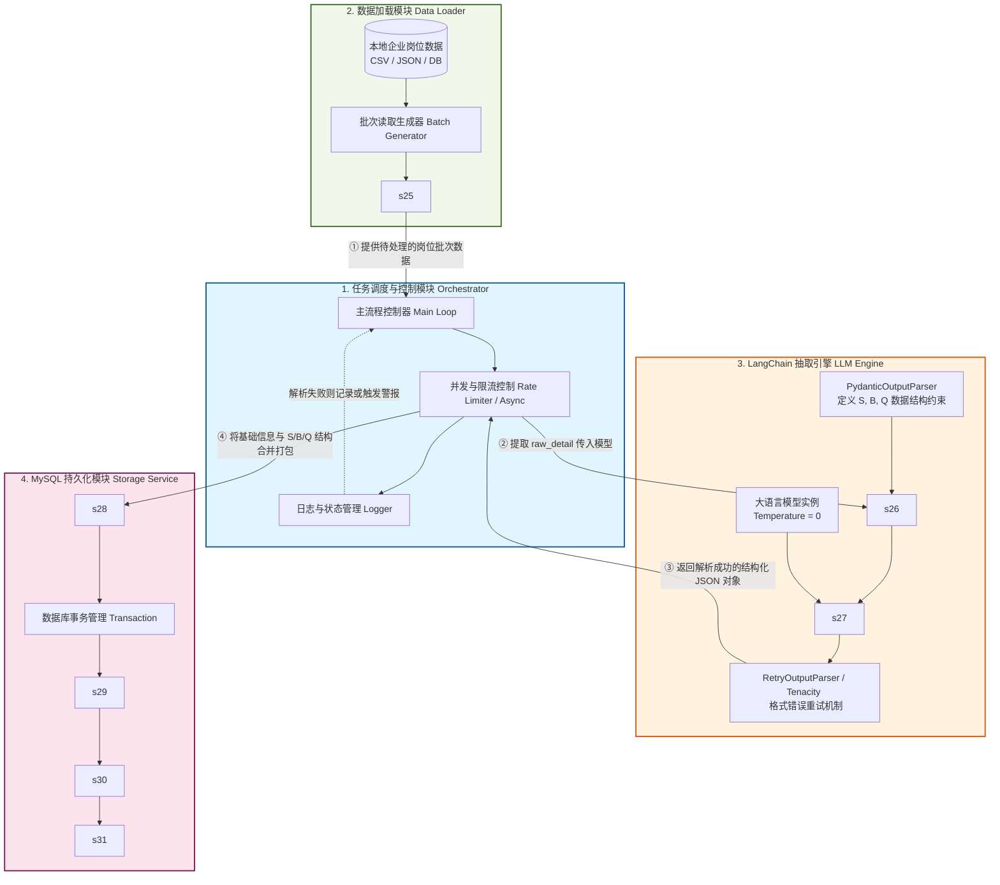

这是一个非常经典的基于 LLM 的结构化信息抽取（IE）工程。考虑到你日常使用 PyCharm 开发，并且这套系统需要处理一万条数据，基于 Python 的 LangChain 框架结合 MySQL 是非常高效的选择。同时，针对中文文本的深度理解和结构化输出，底层模型配置为 Qwen 系列会是一个极佳的方案。

以下是该就业岗位画像体系的详细实现文档：

## 构建就业岗位画像体系：系统实现文档

本系统旨在将非结构化的岗位详情文本，转化为符合 $P_{job}=(S,B,Q,G)$ 范式的结构化画像数据，并最终持久化至 MySQL 数据库。

### 1. 系统模块划分

整个工程可以拆分为四个核心模块，确保高内聚、低耦合，方便后续扩展或替换组件。

-   **数据加载模块 (Data Loader):** 负责对接数据源，读取一万条初始企业岗位数据。
    
-   **LangChain 抽取引擎 (LLM Engine):** 系统的“大脑”，负责组装 Prompt、调用大模型并强制校验输出格式。
    
-   **MySQL 持久化模块 (Storage Service):** 负责将校验后的结构化数据与基础字段拼接，并执行数据库写入。
    
-   **任务调度与控制模块 (Orchestrator):** 负责统筹整个数据流，处理并发、接口限流（Rate Limit）以及错误重试。
    

----------

### 2. 核心模块详细设计

#### 2.1 数据加载模块 (Data Loader)

-   **功能描述：** 从 CSV、JSON 文件或源数据库中按批次读取一万条数据。
    
-   **核心输出：** 生成包含 `job_name` (岗位名称)、`industry` (所属行业) 和 `raw_detail` (岗位详情) 的数据字典或数据类对象。
    
-   **技术建议：** 使用 Python 内置的 `csv` 或 `pandas` 库实现批量生成器（Generator），避免一次性将万条数据加载到内存中。
    

#### 2.2 LangChain 抽取引擎 (LLM Engine)

-   **功能描述：** 将岗位详情文本输入 LLM，强制模型按预定 Schema 输出 JSON 格式的核心技能 ($S$)、基础门槛 ($B$) 和职业素养 ($Q$)。
    
-   **核心组件与步骤：**
    
    -   **Schema 定义：** 使用 LangChain 的 `PydanticOutputParser`。定义一个 Pydantic 类，严格声明 `skills`、`thresholds` 和 `professionalism` 列表，且列表元素必须包含 `name` 和 `evidence` 字段。
        
    -   **Prompt 模板构建：** 使用 `PromptTemplate`，将解析器的格式化指令（Format Instructions）和具体的岗位详情注入到 Prompt 中，明确告知模型不要输出任何 Markdown 标记以外的废话。
        
    -   **模型实例化：** 使用 `ChatOpenAI` 接口类（可配置 Base URL 和 API Key 指向 Qwen 等模型的服务端点），并将 `temperature` 设置为 0，以保证抽取的稳定性。
        
    -   **链式调用 (Chain)：** 将 Prompt、LLM 和 OutputParser 组装成一条 Runnable Sequence (`prompt | model | parser`)。
        

#### 2.3 MySQL 持久化模块 (Storage Service)

-   **功能描述：** 接收 LangChain 引擎输出的结构化对象，将其映射到上一轮设计的 `jobs` 和 `job_features` 表中。
    
-   **核心步骤：**
    
    -   开启数据库事务。
        
    -   向 `jobs` 表插入 `job_name`、`industry` 和完整的 `raw_detail`，并获取返回的自增主键 `job_id`。
        
    -   遍历解析出来的 `skills`、`thresholds` 和 `professionalism` 列表。
        
    -   携带对应的 `feature_type` 标识（如 1 代表技能，2 代表门槛）和 `job_id`，批量插入到 `job_features` 表中。
        
    -   提交事务。
        
-   **技术建议：** 推荐使用 `SQLAlchemy` 作为 ORM 框架，或者使用 `PyMySQL` 执行原生的批量插入 SQL 以提升性能。
    

#### 2.4 任务调度与控制模块 (Orchestrator)

-   **功能描述：** 协调上述三个模块的工作流，是程序的入口。
    
-   **核心机制：**
    
    -   **错误重试：** 由于大模型可能偶尔输出不符合规范的 JSON，必须引入 LangChain 的 `RetryOutputParser` 或使用 `Tenacity` 库进行失败重试。
        
    -   **并发控制：** 处理一万条数据时，串行处理耗时过长。建议使用 Python 的 `asyncio` 或 `ThreadPoolExecutor` 进行并发调用，同时注意控制并发数以防触发 LLM API 的限流（HTTP 429 错误）。
        
    -   **日志记录：** 记录每一条数据的处理状态（成功、跳过、失败），方便对失败的少量数据进行人工干预。
        

----------

### 3. 模块依赖与数据流转关系

模块之间的依赖是单向且清晰的：

1.  **Orchestrator** 调用 **Data Loader** 获取一条待处理的岗位数据。
    
2.  **Orchestrator** 提取出岗位详情，将其作为参数传递给 **LLM Engine**。
    
3.  **LLM Engine** 完成大模型交互与 JSON 校验，将结构化的 Python 字典/对象返回给 **Orchestrator**。
    
4.  **Orchestrator** 将该结构化对象连同基础字段（岗位名称、所属行业）打包，传递给 **Storage Service**。
    
5.  **Storage Service** 执行 SQL 写入，返回操作成功状态。
    

